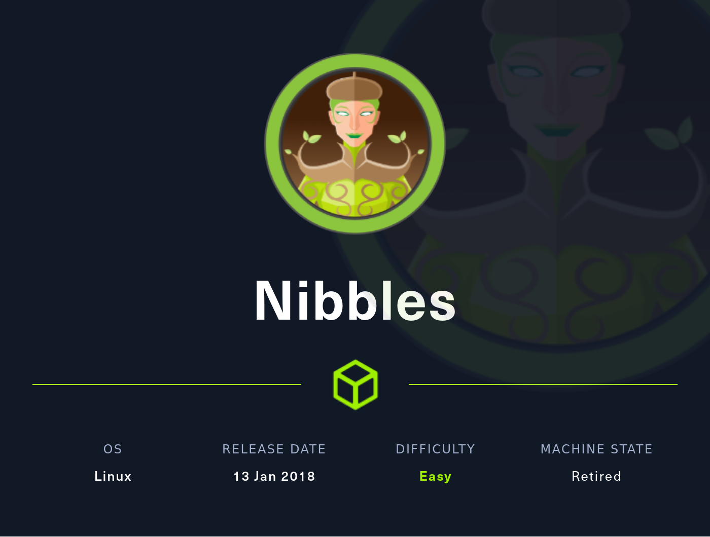

# [01 - Nibbles](https://app.hackthebox.com/machines/Nibbles)



## description
> 10.10.10.75

## walkthrough

### recon

```
$ nmap -sC -sV -A -Pn -p- nibbles.htb
Starting Nmap 7.80 ( https://nmap.org ) at 2022-07-29 17:11 MDT
Nmap scan report for nibbles.htb (10.10.10.75)
Host is up (0.059s latency).
Not shown: 65533 closed ports
PORT   STATE SERVICE VERSION
22/tcp open  ssh     OpenSSH 7.2p2 Ubuntu 4ubuntu2.2 (Ubuntu Linux; protocol 2.0)
| ssh-hostkey:
|   2048 c4:f8:ad:e8:f8:04:77:de:cf:15:0d:63:0a:18:7e:49 (RSA)
|   256 22:8f:b1:97:bf:0f:17:08:fc:7e:2c:8f:e9:77:3a:48 (ECDSA)
|_  256 e6:ac:27:a3:b5:a9:f1:12:3c:34:a5:5d:5b:eb:3d:e9 (ED25519)
80/tcp open  http    Apache httpd 2.4.18 ((Ubuntu))
|_http-server-header: Apache/2.4.18 (Ubuntu)
|_http-title: Site doesn't have a title (text/html).
Service Info: OS: Linux; CPE: cpe:/o:linux:linux_kernel
```

### 80

while waiting for nmap, check 80:
```
$ curl -v http://nibbles.htb
*   Trying 10.10.10.75:80...
* Connected to nibbles.htb (10.10.10.75) port 80 (#0)
> GET / HTTP/1.1
> Host: nibbles.htb
> User-Agent: curl/7.74.0
> Accept: */*
>
* Mark bundle as not supporting multiuse
< HTTP/1.1 200 OK
< Date: Fri, 29 Jul 2022 23:01:26 GMT
< Server: Apache/2.4.18 (Ubuntu)
< Last-Modified: Thu, 28 Dec 2017 20:19:50 GMT
< ETag: "5d-5616c3cf7fa77"
< Accept-Ranges: bytes
< Content-Length: 93
< Vary: Accept-Encoding
< Content-Type: text/html
<
<b>Hello world!</b>


<!-- /nibbleblog/ directory. Nothing interesting here! -->
```

ok, looks like we know where we're going

`/nibbleblog/index.php?controller=blog&amp;action=view&amp;category=uncategorised`

definitely PHP

seeing a 404 for `GET /nibbleblog/content/private/plugins/my_image/image.jpg HTTP/1.1`

and `content` allows directory listing
  * private
  * public
  * tmp

`tmp` is empty

and.. private is accessible?

using `wget --recursive` and some probably unnecessary flags, crawled the contents of.. `content` and found a bunch of nothing. did find a couple images

```
$ find . -iname '*.jpg'
./nibbles.htb/nibbleblog/content/public/upload/nibbles_0_o.jpg
./nibbles.htb/nibbleblog/content/public/upload/nibbles_0_nbmedia.jpg
./nibbles.htb/nibbleblog/content/public/upload/nibbles_0_thumb.jpg
```

no strings, zsteg or bw content, so moving on.

### nibble

assumed `Powered by Nibbleblog` was a red herring and that this blog posting/hosting software was something homegrown, or at least forked from something more mainstream. searched for `index.php controller=blog action=view category=music` and got to [http://letsmaketech.com/index.php?controller=blog&action=view&category=articles](http://letsmaketech.com/index.php?controller=blog&action=view&category=articles) which uses the same URI format.. and is also `Powered by Nibbleblog`. ok, so this is a real thing that someone actually named their software.

```
msf6 > search nibble

Matching Modules
================

   #  Name                                       Disclosure Date  Rank       Check  Description
   -  ----                                       ---------------  ----       -----  -----------
   0  exploit/multi/http/nibbleblog_file_upload  2015-09-01       excellent  Yes    Nibbleblog File Upload Vulnerability
```

this box was released in 2018, so a bit late, but still possible.

however, the module is authenticated, so while it does get us RCE, it doesn't get us there yet.

looking around for a place to even login, eventually get to `nibbles.htb/nibbleblog/admin`, which doesn't give us login, but does `http://nibbles.htb/nibbleblog/admin/ajax/` 
which has
  * `uploader (copy).php`
  * `uploader.php`

with slightly different file sizes.

```
$ curl 'http://nibbles.htb/nibbleblog/admin/ajax/uploader%20(copy).php'
<error><![CDATA[1]]></error><alert><![CDATA[Nibbleblog security error(1024)]]></alert>
```

but one of the response headers is `Content-Type: application/json`, so not parsing properly in the browser

and the 'non copy' version returns the same content, but with `Content-Type: text/xml;charset=UTF-8`

so was the content type the only change? what are we supposed to send to it?

[https://github.com/dignajar/nibbleblog/blob/master/admin/ajax/uploader.php](https://github.com/dignajar/nibbleblog/blob/master/admin/ajax/uploader.php) was last changed on 2014/02/27, so possible

the committed version says it will return json


```
http://nibbles.htb/nibbleblog/admin.php
```

gives us a username/password prompt

```
var HTML_PATH_ROOT = "/nibbleblog/";
var HTML_PATH_ADMIN = "/nibbleblog/admin/";
var HTML_PATH_ADMIN_AJAX = "/nibbleblog/admin/ajax/";
var HTML_PATH_ADMIN_JS = "/nibbleblog/admin/js/";
var HTML_PATH_ADMIN_TEMPLATES = "/nibbleblog/admin/templates/";
var _MAX_FILE_SIZE = 1024 * 3000;
```

`http://nibbles.htb/nibbleblog/install.php` gives
> Blog already installed... May be you want to update ?

update is a link to [http://nibbles.htb/nibbleblog/update.php](http://nibbles.htb/nibbleblog/update.php)

which GETting gives us
```
DB updated: ./content/private/config.xml

DB updated: ./content/private/comments.xml

Categories updated...


Nibbleblog 4.0.3 "Coffee" ©2009 - 2014 | Developed by Diego Najar
```

finally, confirmation of the version - and 4.0.3 is what msf supports, so we're on the right path

so figure out what `Nibbleblog security error(1024)` is about, use it for LFI, and then find creds?


## flag
```
user:
root:
```
